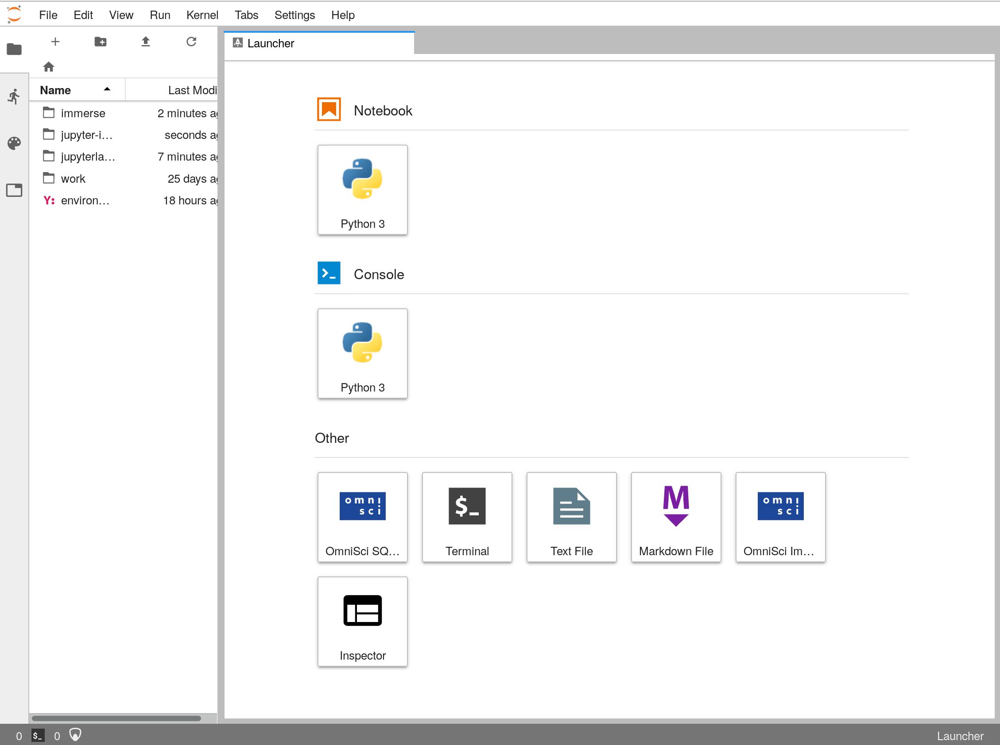
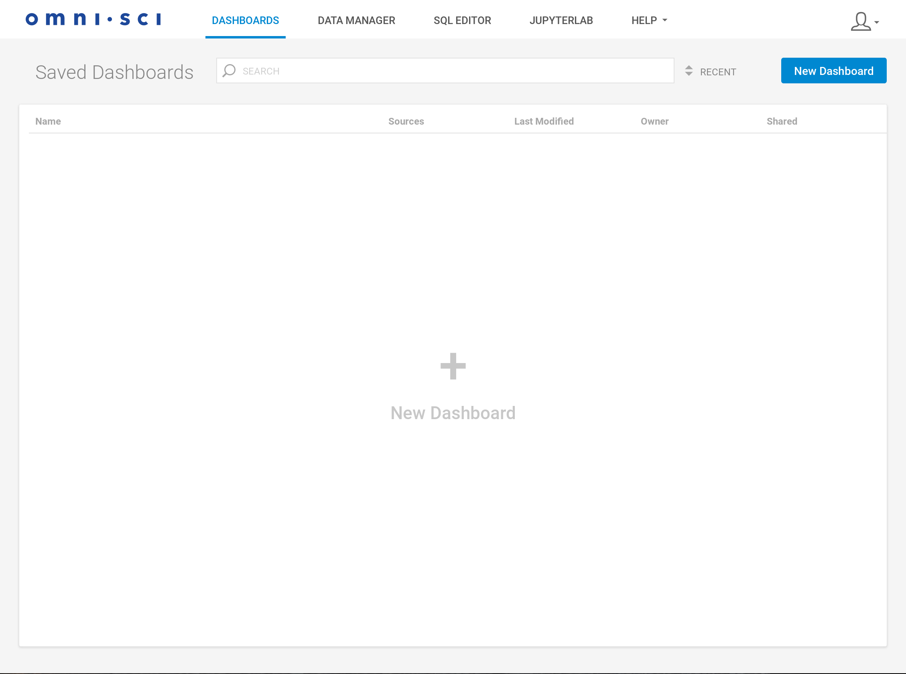
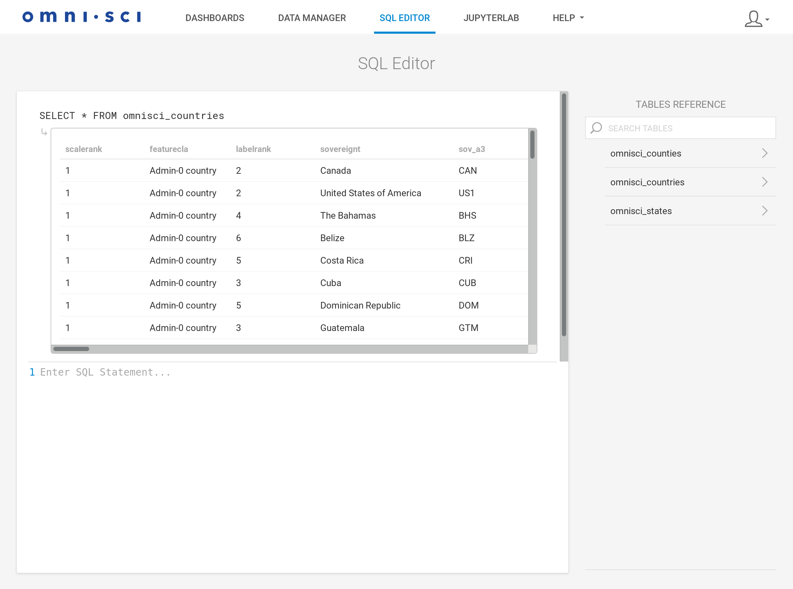
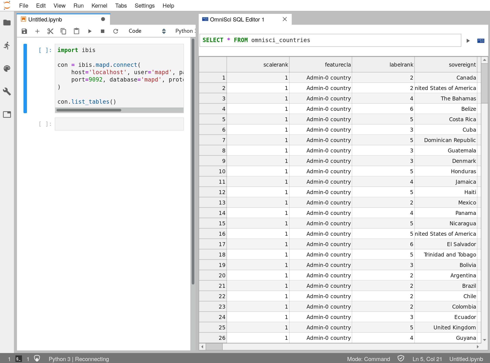

# JupyterLab-Immerse deployment demo

This is a demonstration of how JupyterLab and OmniSci Immerse could be deployed side-by-side.
It consists of several components, all interacting:

* JupyterLab, a general-purpose interactive computing environment.
* OmniSci Immerse
* A Jupyter server extension for serving Immerse under the same webserver as lab.
* Several frontend JupyterLab extensions for better interacting with OmniSci databases.

## Installation

This repository contains a submodule for OmniSci Immerse which must also be cloned.
You can clone the whole repository with
```bash
git clone --recurse-submodules https://github.com/Quansight/jupyterlab-immerse-deploy.git
```

Once the repository is downloaded, build and launch the project in a docker image by running
```bash
docker-compose up --build
```
This may take a few minutes.


## Running

In your web browser go to `http://localhost:8888/lab`, which should take you to JupyterLab.

You should see something like the following:


In this environment you can create notebooks, and interact with OmniSci backends using Ibis,
Vega/Vega-lite, Altair, and pymapd. You can also form SQL queries with the SQL editor widget.

If at some point you want to make an Immerse dashboard, you can click on the
`OmniSci Immerse` button in the JupyterLab launcher.
This should take you to Immerse, and auto-log-in using the credentials specified in [`servers.json`](./servers.json).
At this point, you should see something like this:



Here you can make charts, explore with the data manager, and make queries using the SQL editor:



But if you want to move back to lab to do some more general-purpose programming,
you can click on the `JupyterLab` button in the navigation bar.
This should open a JupyterLab workspace in a new tab:



This workspace should be prepopulated with the same connection to the OmniSci database
that was used in Immerse. In addition, there will be a new notebook with an Ibis connection,
and a SQL editor with the same query as the Immerse editor.
